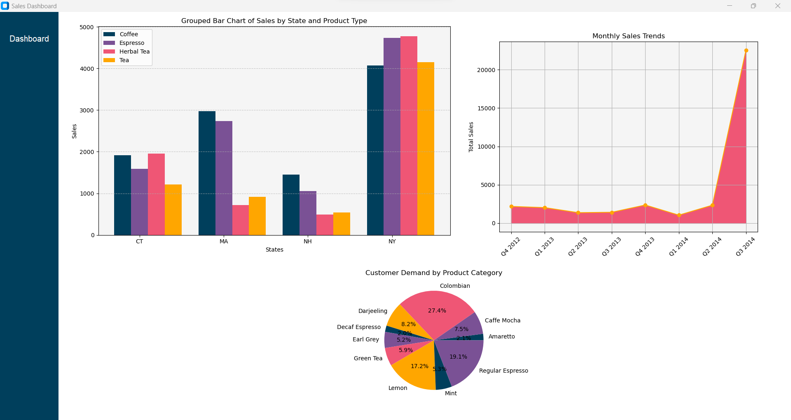

# coffee_sales_analysis

This repository contains an analysis of sales data from a fictional coffee company. I set out to create a dashboard using Python and TKinter to A. Practice my exploratory data analytics skills, B. Create an in-depth dashboard using TKinter, and 3. Practice making visualizations using MatPlotLib. 

The data from this project can be found [here.](https://www.kaggle.com/datasets/amruthayenikonda/coffee-chain-sales-dataset) I added the State_abbr column to the raw data folder in order to decrease the size of the state names on each visualization. 

The goal of this analysis is to provide sales insights of the Northeastern territory over the range of the data. This is done by breaking data down into quarterly sales, and creating visualizations that break down the sales by state, product, and over time. The current version of the dashboard is depicted below. 

